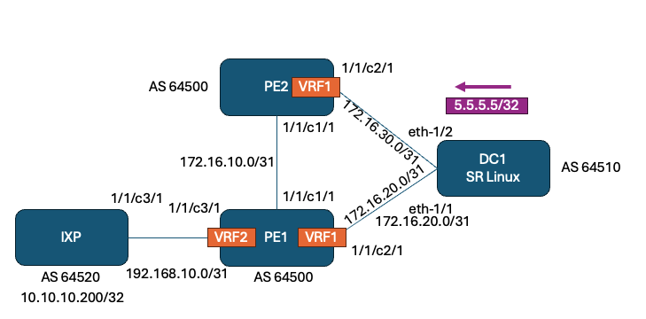

# VPRN route leaking in SR OS


VRF2 route table on PE1 showing 5.5.5.5/32 next-hop is VRF1

```srl
A:admin@pe1# show router 2 route-table 

===============================================================================
Route Table (Service: 2)
===============================================================================
Dest Prefix[Flags]                            Type    Proto     Age        Pref
      Next Hop[Interface Name]                                    Metric   
-------------------------------------------------------------------------------
5.5.5.5/32                                    Remote  BGP VPN   00h00m47s  170
       Local VRF [1:to-DC]                                          0
10.10.10.200/32                               Remote  BGP       00h00m18s  170
       192.168.10.1                                                 0
172.16.20.0/31                                Remote  BGP VPN   00h01m08s  0
       Local VRF [1:to-DC]                                          0
172.16.20.0/32                                Remote  BGP VPN   00h01m08s  0
       Local VRF [1:to-DC]                                          0
192.168.10.0/31                               Local   Local     00h01m08s  0
       to-IXP                                                       0
-------------------------------------------------------------------------------
```

VRF1 route table on PE1 showing IXP loopback next-hop is VRF2

```srl
A:admin@pe1# show router 1 route-table 

===============================================================================
Route Table (Service: 1)
===============================================================================
Dest Prefix[Flags]                            Type    Proto     Age        Pref
      Next Hop[Interface Name]                                    Metric   
-------------------------------------------------------------------------------
5.5.5.5/32                                    Remote  BGP       00h00m40s  170
       172.16.20.1                                                  0
10.10.10.200/32                               Remote  BGP VPN   00h00m12s  170
       Local VRF [2:to-IXP]                                         0
172.16.20.0/31                                Local   Local     00h01m02s  0
       to-DC                                                        0
172.16.30.0/31                                Remote  BGP VPN   00h00m12s  170
       10.10.10.2 (tunneled)                                        1
172.16.30.0/32                                Remote  BGP VPN   00h00m12s  170
       10.10.10.2 (tunneled)                                        1
192.168.10.0/31                               Remote  BGP VPN   00h01m02s  0
       Local VRF [2:to-IXP]                                         0
-------------------------------------------------------------------------------
```

Ping 5.5.5.5/32 from IXP:

```srl
A:admin@ixp# ping 5.5.5.5
PING 5.5.5.5 56 data bytes
64 bytes from 5.5.5.5: icmp_seq=1 ttl=63 time=5.80ms.
64 bytes from 5.5.5.5: icmp_seq=2 ttl=63 time=2.74ms.
64 bytes from 5.5.5.5: icmp_seq=3 ttl=63 time=2.14ms.
64 bytes from 5.5.5.5: icmp_seq=4 ttl=63 time=3.48ms.
64 bytes from 5.5.5.5: icmp_seq=5 ttl=63 time=1.54ms.

---- 5.5.5.5 PING Statistics ----
5 packets transmitted, 5 packets received, 0.00% packet loss
round-trip min = 1.54ms, avg = 3.14ms, max = 5.80ms, stddev = 1.48ms
```
